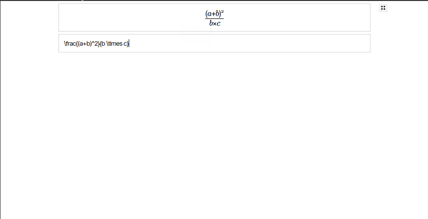

# EditorJS-LaTeX
[](https://www.jsdelivr.com/package/gh/mdgaziur/EditorJS-LaTeX)
Check the example: https://mdgaziur.github.io/EditorJS-LaTeX/example


### LaTeX block support for EditorJS
### Created By: MD Gaziur Rahman Noor



## Setting Up
Add the following code inside the ```<head>``` tag.


```html
<!-- Katex -->
<script defer src="https://cdn.jsdelivr.net/npm/katex@0.16.22/dist/katex.min.js"></script>
<link rel="stylesheet" href="https://cdn.jsdelivr.net/npm/katex@0.16.22/dist/katex.min.css"/>

<!-- The library itself -->
<link rel="stylesheet"
    href="https://cdn.jsdelivr.net/gh/mdgaziur/EditorJS-LaTeX@1.0.5/dist/editorjs-latex.bundle.css"/>
<script src="https://cdn.jsdelivr.net/gh/mdgaziur/EditorJS-LaTeX@1.0.5/dist/editorjs-latex.bundle-min.js"></script>
```
To use with nodejs simply run ```npm i editorjs-latex``` and import using the following code:
```javascript
const EJLaTeX = require('editorjs-latex');
```


To add this library to EditorJS, simply add the follwing code:

```javascript
tools: {
        Math: {
        class: EJLaTeX,
        shortcut: 'CMD+SHIFT+M'
    }, ...
}
```

If you need to adjust the theming of the editor, you can add CSS rules in the config like:

```javascript
tools: {
        Math: {
        class: EJLaTeX,
        shortcut: 'CMD+SHIFT+M',
        config: {
            css: '.math-input-wrapper { padding: 5px; }'
        }
    }, ...
}
```

## Getting data
The output data of this plugin will look like bellow:

```json
{
    "type" : "Math",
    "data" : {
        "math" : "\\frac{a \\pm b}{(a+b)^2}"
    }
}
```

The "math" item contains the expression. You can use KaTeX to render that in your document.


## Conclusion
If there is any problem or bugs, create an issue in this repository. I'll try my best to help you.
